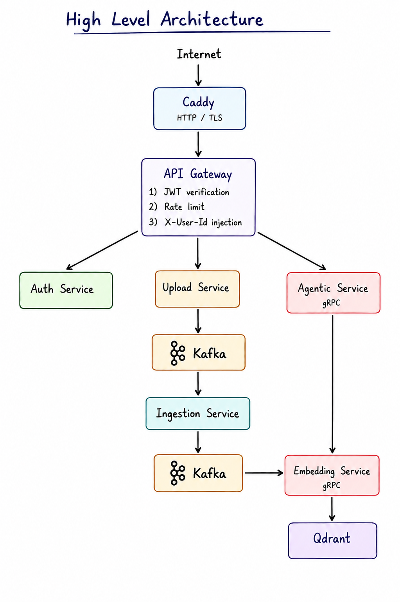

# 📚 Sinhala Learning & Assessment Platform

<p align="center">
  
  
  
  
</p>

<p align="center">
  <b>Empowering Sinhala education through Artificial Intelligence</b>
</p>

---

## 🌟 Overview

The **Sinhala Learning & Assessment Platform** is an AI-powered educational system designed to transform how users learn and evaluate Sinhala educational content.

Users can upload Sinhala books and learning materials, interact with their content through AI, generate practice questions, submit answers, and receive intelligent feedback for self-learning and assessment.

---

## ✨ Key Features

### 📥 Content Upload

- Upload Sinhala books and educational documents
- Process learning materials automatically
- Maintain uploaded resources for future learning sessions

### 🧠 AI-Powered Learning

- Intelligent Sinhala content understanding
- Ask questions based on uploaded learning materials
- Retrieve relevant information from educational resources
- Generate context-aware responses using AI

### ❓ Question Generation

- Automatically generate questions from uploaded content
- Support interactive practice and self-assessment
- Generate assessments based on selected learning resources

### ✅ Auto Marking & Evaluation

- Submit answers directly through the platform
- Automatically evaluate user responses
- Provide scores and intelligent feedback
- Help users understand incorrect answers

### 📈 Self Assessment

- Practice using uploaded educational materials
- Evaluate understanding through generated questions
- Receive immediate feedback
- Encourage independent and continuous learning

---

## 🏗️ High-Level Architecture

<p align="center">
  
</p>

The platform follows a **service-oriented architecture** where individual services are responsible for authentication, document ingestion, AI interaction, embedding generation, and vector retrieval.

### Core Components

**Caddy**  
Handles HTTPS/TLS and forwards incoming traffic to the API Gateway.

**API Gateway**  
Provides a single entry point for backend services and handles JWT verification, rate limiting, routing, and user identity injection.

**Auth Service**  
Manages authentication and user-related security operations.

**Upload Service**  
Handles document uploads and initiates asynchronous document processing.

**Kafka**  
Provides asynchronous event communication between document-processing services.

**Ingestion Service**  
Extracts, processes, normalizes, and chunks educational content before embedding.

**Embedding Service**  
Generates and manages vector representations used for semantic retrieval.

**Qdrant**  
Stores document vectors and enables efficient similarity-based retrieval.

**Agentic Service**  
Coordinates AI reasoning and communicates with the embedding service to retrieve relevant educational context.

---

## 🔄 Document Processing Flow

```text
User
  │
  ▼
Caddy
  │
  ▼
API Gateway
  │
  ▼
Upload Service
  │
  ▼
Kafka
  │
  ▼
Ingestion Service
  │
  ▼
Kafka
  │
  ▼
Embedding Service
  │
  ▼
Qdrant
```

Uploaded documents are processed asynchronously so ingestion and embedding workloads do not block normal user requests.

---

## 🤖 AI Interaction Flow

```text
User Question
     │
     ▼
API Gateway
     │
     ▼
Agentic Service
     │
     │ gRPC
     ▼
Embedding Service
     │
     ▼
Qdrant
     │
     ▼
Relevant Context
     │
     ▼
Agentic Service
     │
     ▼
AI Response
```

The Agentic Service retrieves relevant information from uploaded learning resources and uses the retrieved context to generate grounded responses.

---

## 🎯 Project Purpose

The project aims to create an intelligent Sinhala learning ecosystem where users can:

- 📖 Study Sinhala educational materials digitally
- 💬 Ask questions about uploaded learning resources
- 📝 Generate practice questions automatically
- 🎓 Evaluate their knowledge instantly
- 💡 Receive intelligent feedback on their answers
- 🚀 Improve learning efficiency through AI-assisted self-study

The platform seeks to make Sinhala education more **accessible, interactive, intelligent, and scalable**.

---

## 🚧 Project Status

> **This project is currently under active development.**

The architecture, backend services, AI components, assessment system, and user experience are being developed incrementally.

Features and architecture may evolve as development continues.

---

## 🔒 License

This repository contains a **private proprietary project** and is **not open-source**.

Unauthorized copying, distribution, modification, reproduction, or commercial use of this software is prohibited without explicit permission from the project owners.

---

## 🏢 Ownership

<div align="center">

### 🌌 Developed and owned by **Apeironaut**

*Exploring the frontier of AI and innovation.*

</div>

---

<p align="center">
  Made with ❤️ for Sinhala Education
</p>