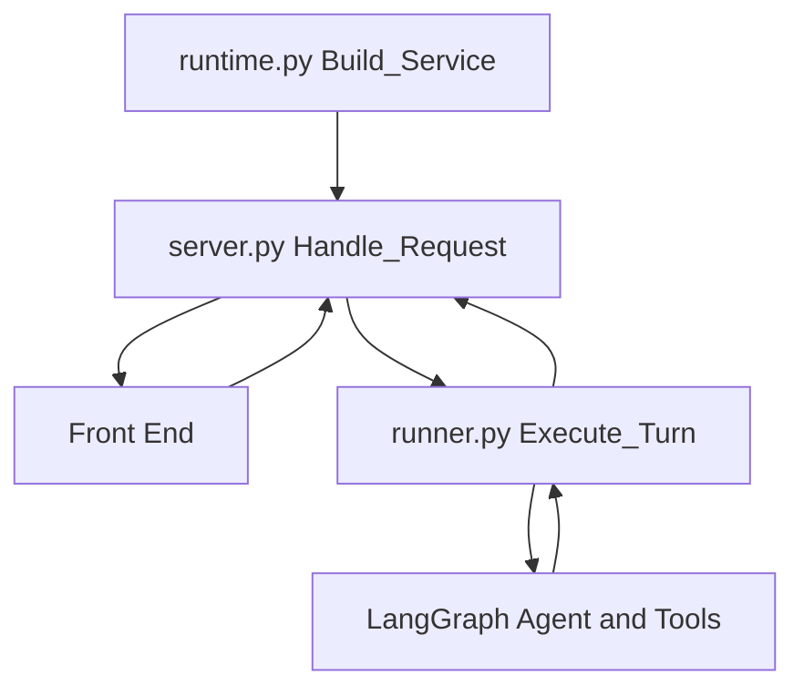

# Slashus Agentic Service: Archtecture, Data Flow, and Implementaion Guid

The service is a real model-controlled ReAct agent. It is not a fixed Python router disguised as an agent. langchain.agents.create_agent binds native tools to the LLM, and the LLM decides whether to answer, call a tool, repeat retrieval with new arguments, write memory, create a quiz, or stop.

The architecture:
  - FastAPI provides the HTTP boundary.
  - LangChain/LangGraph provides the agent loop and checkpointed conversation state.
  - Qwen is accessed through an OpenAI-compatible API.
  - PostgreSQL stores sessions, visible chat history, quizzes, answers, and long-term memories.
  - pgvector recalls semantic and episodic memories.
  - Redis stores LangGraph checkpoints and the semantic response cache.
  - The embedding service owns BGE-M3 and Qdrant access behind gRPC.
  - Python not the LLM controls identity, tenancy, limits, persistence, and citation validation.


## System boundary
Client["React client"] --> Gateway["API Gateway"]
Gateway --> API["FastAPI agentic service"]
API --> Runner["TurnRunner"]
Runner --> Cache["Redis semantic cache"]
Runner --> Agent["LangGraph ReAct agent"]
Agent --> LLM["Qwen via Dashscope"]
Agent --> Tools["Native agent tools"]
Tools --> GRPC["gRPC embedding service"]
GRPC --> Qdrant["Qdrant + BGE-M3"]
Tools --> Postgres["PostgreSQL + pgvector"]
Agent --> Checkpoint["Redis checkpointer"]
API --> Postgres


```
runtime.py:
It is the composition root and lifecycle manager.
Its job is to construct everything once when the service starts
Settings
Database engine
Repository
Redis
Vector client
Memory store
LLM
Cache
Evaluator
Agent tools
LangGraph agent
TurnRunner
FastAPI application

Without runtime.py, individual API endpoints might need to create their own database, Redis, LLM and agent clients. That would create duplicated connections and poorly organized code.

Startup flow:
Application starts
→ load environment settings
→ configure logs and tracing
→ connect database
→ connect Redis
→ connect vector service
→ build memory system
→ build LLM
→ build tools
→ build LangGraph agent
→ build TurnRunner
→ check dependencies
→ create FastAPI app
→ start Uvicorn

Shutdown flow:
Mark service as shutting down
→ stop accepting new traffic
→ wait for memory consolidation
→ close vector connection
→ close memory store
→ close Redis
→ close database pool
→ stop application

Scalability purpose

It builds shared clients once per service instance:
One database pool per replica
One Redis pool per replica
One gRPC client per replica
One agent graph per replica
```

```
api/server.py
It understands:
URLs
Request bodies
Headers
Authentication
HTTP errors
JSON responses
SSE streaming
Health endpoints
Prometheus endpoint

The frontend sends:
{
  "message": "Explain photosynthesis",
  "session_id": null,
  "doc_ids": ["document-uuid"],
  "stream": true
}

The gateway validates the user’s JWT and forwards:
X-User-Id: user-uuid
X-Gateway-Secret: internal-secret
X-Correlation-Id: request-uuid

Request validation
Authentication
Session management
Calling the runner
Saving chat history
Endpoints
Recall memory
Delete memory
Health
```

```
agent/runner.py
controls one complete agent turn.

It handles:

Per-turn configuration
Conversation checkpoint identification
Semantic cache lookup
Timeout protection
Agent invocation
Streaming agent events
Tool event reporting
Token and iteration counting
Citation validation
Cache storage
Long-term memory consolidation
```

```
agent.py
The most important line is:

agent = create_agent(...)
That creates the repeating agent loop:
Call LLM
→ LLM may request a tool
→ execute tool
→ return tool result to LLM
→ LLM decides again
→ eventually return a final answer

This shows reACT loop
Reason → Act → Observe → Reason again
e.g:- 
  Reason: I need the student’s textbook information.
  Act: Call search_documents.
  Observe: Read the returned passages.
  Reason: The passages are sufficient.
  Answer: Generate the grounded explanation.

slashus contains:
This description contains three separate concepts:

ReAct agent
Memory-augmented
Native tool calling

custom memory middleware. Its job is:

Before Qwen is called, search semantic, episodic and procedural memory for the current user, store the recalled memories in agent state, and inject them into Qwen’s system prompt.
```